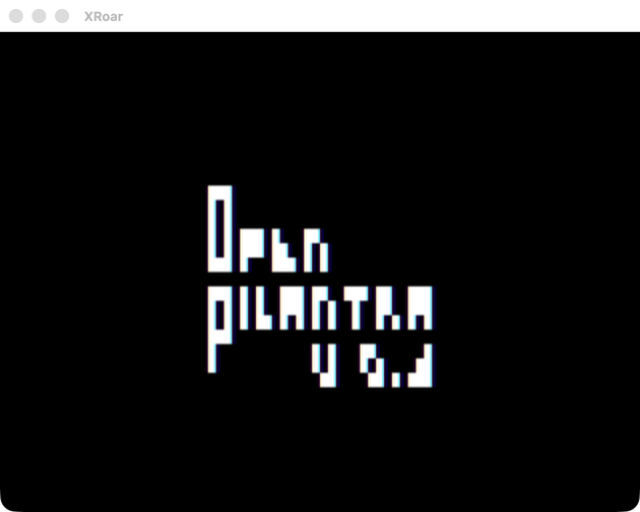
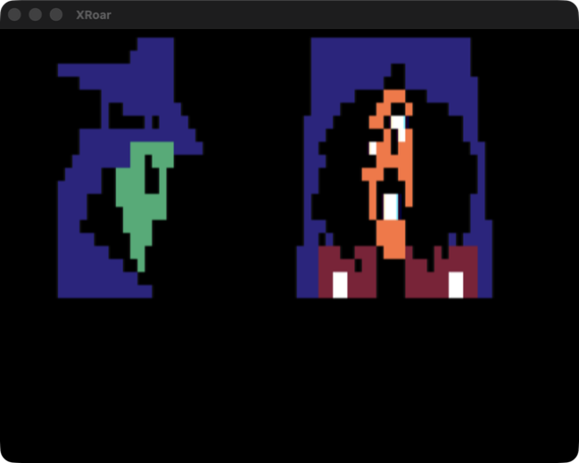
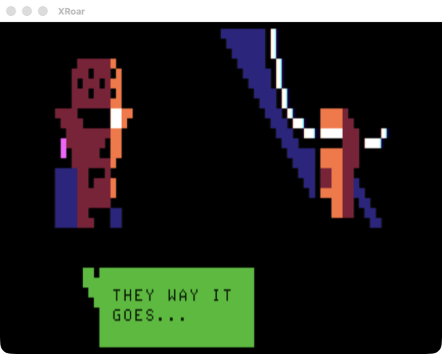
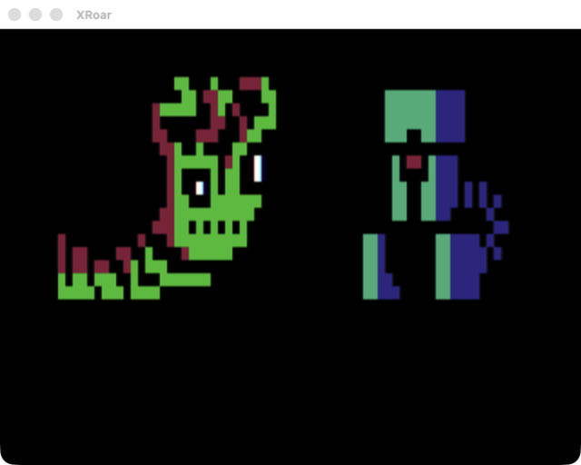
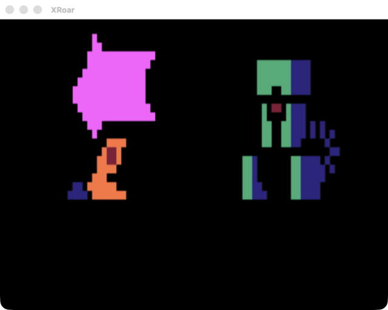

# OPEN PILANTRA

A generative dialogue demo for the TRS-80 Color Computer, written in
[ugBASIC](https://ugbasic.iwashere.eu/) and compiled to native 6809.

> OPEN PILANTRA V0.3 — FUED.NET 2026
>
> By Erico Patricio Monteiro · <https://fued.net/open-pilantra/>

Ten characters meet in randomly chosen pairs, in randomly chosen locations, and
talk past each other in corporate-noir non-sequiturs. No two runs are the same.
The whole thing renders in **SG4 semigraphics** — 64×32 pixels, 8 colors, 512
bytes of screen RAM — and that single constraint is what makes every animation
in it affordable from a compiled BASIC.

## Contents

The author's work and this repository's additions are kept apart.

| Path | What it is |
| --- | --- |
| **`original/`** | **The author's files, untouched** — source, both disk images, his manual, [an analysis of how it all works](original/README.md), and [how it was authored originally](original/AUTHORING-REFERENCE.md). |
| `story/dialogue.json` | Every line of dialogue. Source of truth for text. |
| `art/*.png` | Every portrait, background and prop. Source of truth for graphics. |
| `Makefile` | Builds a `.dsk` from those two; see [Building](#building). |
| `tools/` | The converters that make that possible. |
| `docs/MAKE-YOUR-OWN-STORY.md` | **Authoring guide** — how to write your own dialogue, characters and scenery. |
| `NOTICE` | Attribution and provenance. **Read this before reusing anything.** |
| `LICENSE` | MIT — covers this repository's additions only, not the demo. |



> **Want to write your own?** The demo is built to be rewritten — the manual
> explicitly invites it. See **[Make Your Own
> Story](docs/MAKE-YOUR-OWN-STORY.md)** for the authoring guide: the cast, the
> `DATA` format, the rules that keep randomly-shuffled lines reading as a
> conversation, and how to redraw the characters.

## Running it

Requires [XRoar](https://www.6809.org.uk/xroar/). Both images are RS-DOS disks,
so you need the disk controller cartridge explicitly:

```sh
xroar -machine coco2bus -cart rsdos -load-fd0 original/OPIL-EN.dsk
```

Then at the `OK` prompt, `RUN"LOADER"`.

Verified one-liner that boots, autoruns and quits on its own:

```sh
xroar -machine coco2bus -cart rsdos -load-fd0 original/OPIL-EN.dsk \
      -ao null -timeout 120 -type 'RUN"LOADER"\r'
```

Notes on the flags, learned the hard way:

- **`-cart rsdos` is required.** Without it the machine has no disk controller
  and the image never mounts.
- **`coco2bus`, not `coco2b`.** The unsuffixed profiles are PAL; `…us` are NTSC.
  All the `WAIT nnn MILLISECONDS` pacing in the source was authored against a
  60 Hz machine, so PAL runs everything ~17% slow.
- **`\r`, not `\n`,** in `-type` — it's the Enter key, not a newline.
- `-ao null` keeps it silent (the demo has no audio anyway) and makes the run
  safe to launch from a script.
- `-timeout N` bounds the run, so it's unattended-safe. The demo itself never
  terminates.

Loading takes ~10 s of emulated time before the intro starts. The intro runs
FUED.NET → ugBASIC splash → title card, roughly 25 s, and only then does the
main loop begin.

## Building

Needs `git`, a C compiler, and GNU autotools. On macOS, `make deps` installs
what's missing via Homebrew.

```sh
make deps         # macOS only: autoconf, automake, libtool, bison, gnu-sed
make toolchain    # one-time: builds ugbc.coco, asm6809, decb (a few minutes)
make              # compiles original/OPIL-source.bas -> build/OPIL.dsk
make run          # compiles, then boots the result in XRoar
make compare      # structural diff of the build against original/OPIL-EN.dsk
make clean        # remove build/
make distclean    # also remove the toolchain
```

`make` never writes to the committed `.dsk` images; output goes to `build/`.
The toolchain lands in `.toolchain/` (~800 MB, gitignored). Most of that is the
git clone, so how long `make toolchain` takes depends mostly on your network and
machine: about two and a half minutes on an arm64 Mac on a fast connection, and
correspondingly longer on a slow one.

`make toolchain` has been run end-to-end from an empty `.toolchain/` on macOS
(arm64). See issue #9 for what that run found and fixed.

On Linux the Darwin-specific workarounds below are skipped automatically; you
need `autoconf`, `automake`, `libtool`, `bison` (≥3) and `flex` from your
package manager. Windows is not covered here — ugBASIC ships official binaries
for it, so `make toolchain` is unnecessary; use `ugbc.coco.exe` directly with
the same arguments.

### Where the content lives

**`story/dialogue.json` and `art/*.png` are the sources of truth.** The build
lifts the `DATA` blocks and the `DIM` byte arrays out of `original/OPIL-source.bas`,
re-emits both from those files, and `INCLUDE`s the results — so the words and
the pixels that reach the screen come from the JSON and the PNGs, not from the
BASIC file.

```
story/dialogue.json  ──emit──>  generated/dialogue.bas ─┐
art/*.png ───────────emit──>    generated/art.bas ──────┤
                                                        ├─> ugbc ─> build/OPIL.dsk
original/OPIL-source.bas ─────strip───>  src/opil.bas ───────────┘
                                (INCLUDEs both)
```

`src/` and `generated/` are build artifacts and gitignored. **The build only
ever reads `original/OPIL-source.bas`** — it is never written to, and the `DATA` blocks
still in it are simply ignored.

| Edit this | For |
| --- | --- |
| `story/dialogue.json` | anything a character says |
| `art/*.png` | portraits, backgrounds, props, the title |
| `original/OPIL-source.bas` | code, timing, scene logic |

```sh
make dialogue-lint       # check the authoring constraints before building
make dialogue-extract    # re-derive the JSON from the .bas, if you ever need to
make art-extract         # re-derive the PNGs from the .bas
```

> Those two `extract` targets were how `story/` and `art/` were bootstrapped out
> of the original source. They read the `.bas` and **overwrite** the JSON and the
> PNGs — and the `.bas` no longer tracks either, so running them now discards
> whatever you have written or drawn. They are here for reference, not for
> day-to-day use.

The art PNGs are **indexed**: one pixel per SG4 quadrant, and the pixel value
*is* the palette index. So the round trip never depends on matching RGB, and the
palette is cosmetic — retune it without invalidating any artwork. Anything the
pixel encoding cannot represent (text-mode bytes, or a tile with a colour but no
lit quadrants) is recorded in `art/manifest.json`, which also carries the tile
stride, since the `DIM` arrays do not record their own shape.

This whole path is verified by construction: `src/opil.bas` built from the JSON
and the PNGs compiles to **byte-identical assembly** with `original/OPIL-source.bas` —
6720 instructions, zero differences.

That `INCLUDE` is safe to rely on: compiling the same program with the `DATA`
inline and with it included emits **byte-identical code** — verified on a
reduced case (2056 instructions, differing only in `; L:n` source-line
comments) and on the full demo (6720 instructions, one benign peephole choice
where the compiler loads `$0400` immediate rather than from memory).

### The compile itself

The compile is a single call:

```sh
ugbc.coco -C <asm6809> -b <decb> -o build/OPIL.dsk -O dsk original/OPIL-source.bas
```

`-O dsk` is what produces the `LOADER.BAS` + `P` + `P.00` + `P.01` layout found
on the shipped images, which is how we know that's how they were built.

### Toolchain notes

ugBASIC publishes binaries for Linux and Windows only, so on macOS the Makefile
builds the compiler from source. Four things bite on Darwin, all handled
automatically:

- **macOS ships bison 2.3**; ugbc's grammar needs bison 3. Homebrew's is put
  ahead of it on `PATH` rather than installed over the system one.
- **ugbc's makefile uses GNU `sed -i`**, which BSD sed rejects. `gsed` is used
  instead.
- **`encrypt()` collides.** ugbc declares its own `encrypt()`; Darwin's
  `unistd.h` already declares a POSIX one with a different signature. The
  Makefile renames ugbc's symbol to `ugbc_encrypt`. Note that a `-Dencrypt=…`
  define does *not* work — it renames the system declaration too, and they
  collide again.
- **ugBASIC ships prebuilt Linux x86-64 binaries and objects** inside its
  ToolShed module, and its makefiles treat them as up to date. They're purged so
  the native compiler rebuilds them. (This one isn't strictly Darwin-specific —
  it bites any host that isn't x86-64 Linux — but the Makefile purges them
  unconditionally, which is harmless where they'd have worked.) Skip this and
  `decb` stays an ELF binary,
  and ugbc reports only `The compilation of assembly program failed. Please use
  option '-I' to install chain tool.` — which is misleading, since `-I` was
  removed from ugbc (bug #641) and the actual fault is an unrunnable helper.

### Reproducibility

A fresh build is **not** byte-identical to the shipped images: same 161280-byte
size and same four-file directory, but ~20 700 bytes differ, because the
originals were built with an older ugbc (this was verified against 1.18.1).
The rebuild boots and runs correctly, which is the bar that matters.



*`build/OPIL.dsk`, compiled from source and running under XRoar — Mano Courier
and Shonuf.*

## What it looks like

| | |
| --- | --- |
|  |  |
| The `ugb()` splash. The horizontal colour bands are pure SG4 — read the colour nibble changing by row. | Minhocossul and Isac. Two 15×10 portraits, drawn once, then only the mouth cells move. |
|  |  |
| Caught mid-draw: Elektra painting in tile by tile while Isac is already up. The draw is visibly progressive, and it reads as a deliberate wipe. | The `til()` title, 14×7 cells of solid white. |

### What's on the disk

Both images carry the same four-file ugBASIC build product:

| Entry | Type | Role |
| --- | --- | --- |
| `LOADER.BAS` | BASIC, tokenized | Stub that pulls in the machine-language segments |
| `P` | machine language | Main compiled 6809 binary |
| `P.00`, `P.01` | machine language | Overlay / data segments |

The BR and EN images are byte-identical in structure and differ only in segment
sizes — the English build is a translation of the `DATA` blocks, not a
re-architecture.

The demo never terminates: it plays a run of scenes, drops back to the intro,
and starts over. (How many scenes per cycle is not simply ten — see
[Scene director](original/README.md#scene-director-lines-470490).)

---

---

# Known issues and unfinished work

Tracked in `issues.jsonl` — one JSON object per line, with `id`, `summary`,
`description`, `type`, `status` (open / in-progress / done), `priority` and
`file`. Read it with `jq -c . issues.jsonl`.

The build blocker (#6) is resolved — see [Building](#building) — so source fixes
are now testable.

- ~~**The sentence counter is broken.**~~ Fixed — see
  [The `z` counter](original/README.md#the-z-counter).
- **Three of four cutscene categories are dead.** Line 587 is
  `z=0 :'z=RND(3)` — the randomizer is commented out, so only the skyline
  branch ever runs. The four *backgrounds* (`midl`, `dock`, `citi`, `spac`) are
  all reachable via the `sc` chooser inside that branch; it's the three other
  scene categories the structure implies that were never written.
- **`object:` has room for more props.** Only the briefcase and safe exist;
  there's a conspicuous block of blank lines where more were planned.
- **Portrait arrays carry a spare row and column.** `DIM mano(176)` etc. is a
  16x11 grid, but the draw loop only reaches index `14+9*16 = 158`. Left as
  headroom rather than trimmed (#5).
- **The scene counter counts iterations, not scenes** — see
  [Scene director](original/README.md#scene-director-lines-470490). Open as a question rather than
  a bug, pending the author's intent.
- **Reference captures are incomplete.** `docs/screens/` is missing a
  speech-bubble frame and an `HSCROLL` cutscene, the two most illustrative
  shots.
- **`make toolchain` is only exercised on macOS.** It has been run end to end
  from an empty `.toolchain/` on macOS (arm64). Linux and Windows have not.

## Credits

Artwork by **Erico Patricio Monteiro**, who releases as **FUED.NET** — the
demo, its manual and the original Portuguese script are his too.

Project page: <https://fued.net/open-pilantra/> — free, with source code and a
PDF covering ugBASIC and XRoar setup. If you enjoy this kind of thing, he asks
that you consider donating to support future projects.

> *"Open Pilantra, an ugBasic eternal random animation about thugs plotting
> nefastus schemes."*
> — Erico Patricio Monteiro

Built with [ugBASIC](https://ugbasic.iwashere.eu/) by Marco Spedaletti.
Shown at RetroSC 2025 by the author, and at COCO Fest 2026 by Henry Strickland.

This repository is an unaffiliated study of the demo: the analysis, build
pipeline, authoring guide and issue tracker are additions, MIT-licensed. The
demo, artwork, script and manual remain the author's work and are mirrored here
under his stated intent that people are free to play with it. See
[`NOTICE`](NOTICE) for the full provenance — and if you're the author and would
rather they weren't here, open an issue and they'll come out.
