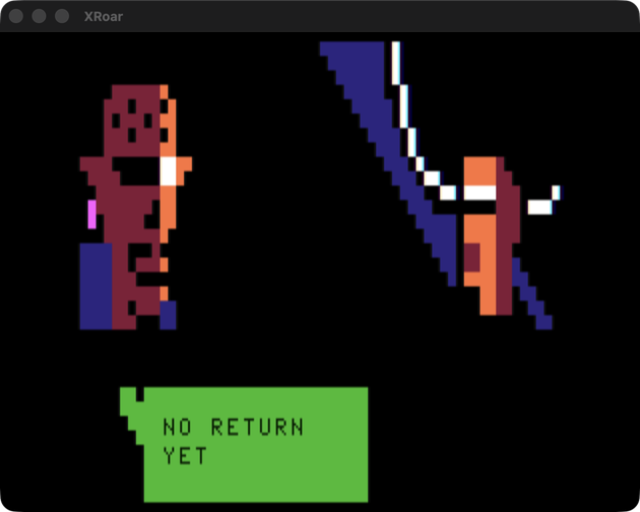

# OPEN PILANTRA

A generative dialogue demo for the TRS-80 Color Computer, written in
[ugBASIC](https://ugbasic.iwashere.eu/) and compiled to native 6809.

> OPEN PILANTRA V0.3 — FUED.NET 2026

Ten characters meet in randomly chosen pairs, in randomly chosen locations, and
talk past each other in corporate-noir non-sequiturs. No two runs are the same.
The whole thing renders in **SG4 semigraphics** — 64×32 pixels, 8 colors, 512
bytes of screen RAM — and that single constraint is what makes every animation
in it affordable from a compiled BASIC.

## Contents

| File | What it is |
| --- | --- |
| `OPIL-source.bas` | ugBASIC source, 873 lines. The whole program. |
| `Makefile` | Builds the source into a `.dsk`; see [Building](#building). |
| `docs/MAKE-YOUR-OWN-STORY.md` | **Authoring guide** — how to write your own dialogue, characters and scenery. |
| `OPIL-EN.dsk` | English build, RS-DOS disk image. |
| `OPIL_BR.dsk` | Brazilian Portuguese build (the original). |
| `OPEN PILANTRA.pdf` | Design document / character art sheet. |
| `517989023_*.jpg` | Character portraits paired with their BR dialogue tables. |


> **Want to write your own?** The demo is built to be rewritten — the manual
> explicitly invites it. See **[Make Your Own
> Story](docs/MAKE-YOUR-OWN-STORY.md)** for the authoring guide: the cast, the
> `DATA` format, the rules that keep randomly-shuffled lines reading as a
> conversation, and how to redraw the characters.

## Running it

Requires [XRoar](https://www.6809.org.uk/xroar/). Both images are RS-DOS disks,
so you need the disk controller cartridge explicitly:

```sh
xroar -machine coco2bus -cart rsdos -load-fd0 OPIL-EN.dsk
```

Then at the `OK` prompt, `RUN"LOADER"`.

Verified one-liner that boots, autoruns and quits on its own:

```sh
xroar -machine coco2bus -cart rsdos -load-fd0 OPIL-EN.dsk \
      -ao null -timeout 120 -type 'RUN"LOADER"\r'
```

Notes on the flags, learned the hard way:

- **`-cart rsdos` is required.** Without it the machine has no disk controller
  and the image never mounts.
- **`coco2bus`, not `coco2b`.** The unsuffixed profiles are PAL; `…us` are NTSC.
  All the `WAIT nnn MILLISECONDS` pacing in the source was authored against a
  60 Hz machine, so PAL runs everything ~17% slow.
- **`\r`, not `\n`,** in `-type` — it's the Enter key, not a newline.
- `-ao null` keeps it silent (the demo has no audio anyway) and makes the run
  safe to launch from a script.
- `-timeout N` bounds the run, so it's unattended-safe. The demo itself never
  terminates.

Loading takes ~10 s of emulated time before the intro starts. The intro runs
FUED.NET → ugBASIC splash → title card, roughly 25 s, and only then does the
main loop begin.

## Building

Needs `git`, a C compiler, and GNU autotools. On macOS, `make deps` installs
what's missing via Homebrew.

```sh
make deps         # macOS only: autoconf, automake, libtool, bison, gnu-sed
make toolchain    # one-time, slow (~30 min): builds ugbc.coco, asm6809, decb
make              # compiles OPIL-source.bas -> build/OPIL.dsk
make run          # compiles, then boots the result in XRoar
make compare      # structural diff of the build against OPIL-EN.dsk
make clean        # remove build/
make distclean    # also remove the toolchain
```

`make` never writes to the committed `.dsk` images; output goes to `build/`.
The toolchain lands in `.toolchain/` (~800 MB, gitignored).

> **Caveat:** `make toolchain` has not yet been run end-to-end from an empty
> `.toolchain/`. Every step was executed and verified by hand while working the
> build out, and the compiler it produces demonstrably works — but the target as
> a single command is untested. See issue #9.

On Linux the Darwin-specific workarounds below are skipped automatically; you
need `autoconf`, `automake`, `libtool`, `bison` (≥3) and `flex` from your
package manager. Windows is not covered here — ugBASIC ships official binaries
for it, so `make toolchain` is unnecessary; use `ugbc.coco.exe` directly with
the same arguments.

The compile itself is a single call:

```sh
ugbc.coco -C <asm6809> -b <decb> -o build/OPIL.dsk -O dsk OPIL-source.bas
```

`-O dsk` is what produces the `LOADER.BAS` + `P` + `P.00` + `P.01` layout found
on the shipped images, which is how we know that's how they were built.

### Toolchain notes

ugBASIC publishes binaries for Linux and Windows only, so on macOS the Makefile
builds the compiler from source. Four things bite on Darwin, all handled
automatically:

- **macOS ships bison 2.3**; ugbc's grammar needs bison 3. Homebrew's is put
  ahead of it on `PATH` rather than installed over the system one.
- **ugbc's makefile uses GNU `sed -i`**, which BSD sed rejects. `gsed` is used
  instead.
- **`encrypt()` collides.** ugbc declares its own `encrypt()`; Darwin's
  `unistd.h` already declares a POSIX one with a different signature. The
  Makefile renames ugbc's symbol to `ugbc_encrypt`. Note that a `-Dencrypt=…`
  define does *not* work — it renames the system declaration too, and they
  collide again.
- **ugBASIC ships prebuilt Linux x86-64 binaries and objects** inside its
  ToolShed module, and its makefiles treat them as up to date. They're purged so
  the native compiler rebuilds them. (This one isn't strictly Darwin-specific —
  it bites any host that isn't x86-64 Linux — but the Makefile purges them
  unconditionally, which is harmless where they'd have worked.) Skip this and
  `decb` stays an ELF binary,
  and ugbc reports only `The compilation of assembly program failed. Please use
  option '-I' to install chain tool.` — which is misleading, since `-I` was
  removed from ugbc (bug #641) and the actual fault is an unrunnable helper.

### Reproducibility

A fresh build is **not** byte-identical to the shipped images: same 161280-byte
size and same four-file directory, but ~20 700 bytes differ, because the
originals were built with an older ugbc (this was verified against 1.18.1).
The rebuild boots and runs correctly, which is the bar that matters.


*`build/OPIL.dsk`, compiled from source and running under XRoar — Mano Courier
and Shonuf.*

## What it looks like

| | |
| --- | --- |
|  |  |
| The `ugb()` splash. The horizontal colour bands are pure SG4 — read the colour nibble changing by row. | Minhocossul and Isac. Two 15×10 portraits, drawn once, then only the mouth cells move. |
|  |  |
| Caught mid-draw: Elektra painting in tile by tile while Isac is already up. The draw is visibly progressive, and it reads as a deliberate wipe. | The `til()` title, 14×7 cells of solid white. |

### What's on the disk

Both images carry the same four-file ugBASIC build product:

| Entry | Type | Role |
| --- | --- | --- |
| `LOADER.BAS` | BASIC, tokenized | Stub that pulls in the machine-language segments |
| `P` | machine language | Main compiled 6809 binary |
| `P.00`, `P.01` | machine language | Overlay / data segments |

The BR and EN images are byte-identical in structure and differ only in segment
sizes — the English build is a translation of the `DATA` blocks, not a
re-architecture.

The demo never terminates: it plays a run of scenes, drops back to the intro,
and starts over. (How many scenes per cycle is not simply ten — see
[Scene director](#scene-director-lines-470490).)

---

# How it works

## The core decision: everything is SG4 semigraphics

There is not a single `PMODE` in the source. Every visual — portraits,
backgrounds, props, the title card — is poked into the **32×16 text buffer at
$0400 (1024–1535)** as SG4 block characters.

An SG4 character byte is:

```
128 + (color × 16) + quadrant_bits
      ^ 0..7         ^ 0..15, one bit per 2×2 quadrant of the cell
```

You can read the palette straight out of the data arrays:

| Byte | Color | Byte | Color |
| --- | --- | --- | --- |
| `128` | black (blank cell) | `191` | red, solid |
| `143` | green, solid | `207` | white/buff, solid |
| `159` | yellow, solid | `223` | cyan, solid |
| `175` | blue, solid | `255` | orange, solid |

Partial values like `165`, `172`, `188` are the same colors with only some
quadrants lit — that's where the diagonal edges in the character art come from.

That one choice buys everything else:

- **512 bytes per screen**, against 6144 for PMODE 4. A full 64×28 background
  map is 896 bytes, so four backgrounds plus ten 15×10 portraits plus three
  props all fit in the program's data segment with room to spare.
- **8 real colors, no artifacting.** No color fringing to design around, and the
  palette is identical on NTSC and PAL. (The *timing* is not — see the run
  notes above.)
- **Redrawing is cheap enough to do from BASIC.** This is the whole game. At
  64×32 the art has to be bold silhouettes with one accent color per figure —
  and the art sheet leans into that rather than fighting it.

## Three animation techniques, each matched to its scene type

### 1. Partial-cell mouth animation — `dialog:` (line 671)

The smartest thing in the file. Portraits are drawn **once**, 15×10 tiles, via
`drawchrl` / `drawchrr` (lines 852, 861). During speech nothing redraws the
portrait. Instead, between 1 and 12 hardcoded addresses flip at 150 ms:

```basic
IF ch1=2 THEN:                       :REM ELEKTRA
    DO
        POKE 1255,188:WAIT #150 MILLISECONDS
        POKE 1255,191:WAIT #150 MILLISECONDS
        INC x:EXIT IF x=6
    LOOP
ENDIF
```

Elektra is a **single byte**. Captain Glord gets twelve, and reads as a whole
head turning:

```basic
POKE 1189,255:POKE 1190,156:POKE 1191,156:POKE 1192,128
POKE 1221,245:POKE 1254,252:POKE 1255,156:POKE 1256,152
POKE 1286,251:POKE 1287,157:POKE 1318,251:POKE 1319,157
```

The addresses are **literal, not computed** — no multiply, no array index, just
a store. That's what lets a compiled BASIC hold a steady 6–7 Hz mouth flap while
text is on screen. It is the classic sprite-animation economy — only touch the
cells that change — applied with real discipline.

### 2. Hardware-assisted scrolling — `cutscene:` (lines 617, 634)

`HSCROLL SCREEN LEFT` shifts the entire buffer, then the code pokes a single
fresh 14-tall column into the seam, read out of a 64-wide map:

```basic
HSCROLL SCREEN LEFT
DO
    IF sc=0 THEN POKE 1055+(y+1)*32,midl(x+y*64)
    ...
    POKE 1024+(y+1)*32,128
    INC y:EXIT IF y=14
LOOP
WAIT #50 MILLISECONDS
```

Fourteen pokes per frame at ~20 fps. Backgrounds are 64 columns wide and the
screen shows a 32-column window, so a scroll traverses exactly one screen-width
of new material. This is the same technique console hardware uses; it's
affordable here only because the buffer is 512 bytes.

The still (non-scrolling) variant picks a fixed mid-map window (`z=16`) instead,
and the scroll direction is itself randomized — `z=0` scrolls left, `z=32`
scrolls right, with a 10-in-15 chance of no scroll at all.

### 3. `CLS` as a full-screen flash — `object:` (line 505)

ugBASIC's `EMPTYTILE` sets the character `CLS` fills with. So a camera-flash cut
costs four `CLS` calls:

```basic
EMPTYTILE=175:CLS:WAIT 75 MILLISECONDS     :REM blue
EMPTYTILE=223:CLS:WAIT 75 MILLISECONDS     :REM cyan
EMPTYTILE=207:CLS:WAIT 400 MILLISECONDS    :REM white
EMPTYTILE=128:CLS                          :REM back to black
```

The safe scene runs the same idea vertically. "Lights down" and "lights up" are
not two sets of art — they're index arithmetic against one `safe()` sprite,
choosing whether a given screen row reads its lit row (`safe(x+(y+1)*19)`) or
the dark row (`safe(x)`):

```basic
POKE 1057+x+y*32,safe(x+(y+1)*19)          :REM DRAW SAFE
IF y>8 THEN POKE 1057+x+(y-11)*32,safe(x)  :REM DRAW DARK
```

Varying the `WAIT` between passes (30 ms down, 60 ms up, 80 ms down) gives the
sweep an ease that a constant delay wouldn't.

## The generative layer

### Scene director (lines 470–490)

A small weighted state machine, biased so the demo never gets monotonous:

```basic
IF sc=0 THEN: GOSUB cutscene : sc=RND(2)+1              :REM → dialog or object
IF sc=1 THEN: GOSUB dialog   : sc=RND(5)
              IF sc>=3 THEN sc=0                        :REM → prefers cutscene
IF sc=2 THEN: GOSUB object   : sc=RND(5)
              IF sc>=1 THEN sc=1                        :REM → prefers dialog
INC c
IF c=10 THEN GOTO intro                                 :REM reset (see below)
```

Objects almost always hand off to dialogue; dialogue leans back toward a
cutscene. The result reads like edited film rather than a shuffle.

**The three `IF`s fall through within a single iteration.** They're sequential
tests, not an `ELSE` chain, so when the cutscene block sets `sc=1` the *very
next* `IF sc=1` fires in the same pass. One trip round the loop can therefore
play cutscene → dialogue → object back-to-back. That's almost certainly
deliberate — it's what produces multi-beat sequences instead of one isolated
scene per iteration — but it does mean `c` counts **iterations, not scenes**, so
`IF c=10 THEN GOTO intro` comes around considerably sooner than "ten scenes".

### Dialogue generation (lines 671–690)

```basic
ch1=RND(5):ch2=RND(5)   :REM left / right character
z=RND(8)+1              :REM scene length; >7 means solo, and clamps to 7
IF z>7 THEN z=7
w=RND(2)                :REM who speaks first
```

Lines are stored as `DATA` blocks behind per-character labels (`manot:`,
`johnt:`, `chavt:` …). Picking a random one is done by `RESTORE`-ing to the
label and reading forward a random number of pairs:

```basic
x=RND(20)*2
DO
    READ SAFE t1
    READ SAFE t2
    EXIT IF x=0
    x=x-2
LOOP
```

Five left characters × five right × 20 line-pairs each × random turn order and
scene length. The writing is deliberately non-sequitur, which is why it holds
together no matter what pairs up — every line is a plausible reply to every
other line.

Confirmed empirically: a captured run put Isac on the right saying
"PROCEDURAL / OLD WAY", which is exactly the `DATA` pair at line 225 of
`OPIL-source.bas`.

### The `z` counter

The author's last line in the source flags a known bug: *"DEFEITO NO CONTADOR DE
FRASE, CORTA RAPIDO E NAO TERMINA"* — the phrase counter cuts short and doesn't
finish. Tracing `z` (with `RND(n)` returning `0..n-1`, confirmed by `ch1=RND(5)`
being tested against `IF ch1=0..4`):

| `z` initial | path through the scene loop | sentences |
| --- | --- | --- |
| 1 | `DEC`→0, print, `EXIT IF z=0` | 1 |
| 2–6 | counts down to 0 | 2–6 |
| 7 | `DEC`→6, print, `IF z=6` → 3 s wait, exit | 1 (solo) |

The arithmetic is sound — `z` initial *is* the sentence count. The symptom came
from two separate defects, both now fixed:

**"CORTA RAPIDO".** The original read:

```basic
z=RND(8)+1
IF z>7 THEN z=7
```

`RND(8)+1` gives 1..8, and the clamp folds 8 onto 7 — but **7 is the one-line
solo sentinel**, so it collected 2/8 of the probability mass. With `z=1` also
yielding one line, 3 in 8 dialogue scenes were a single sentence. Changing it to
`z=RND(7)+1` and dropping the clamp makes 1..7 uniform: single-line scenes fall
from 37.5% to 28.6%, and mean length rises from 2.88 to 3.14 sentences.

**"NAO TERMINA".** The scene loop was followed by:

```basic
LOOP
x=352:DO:POKE 1024+x,128:INC x:EXIT IF x=512:LOOP   :REM CLS dialog area
WAIT #1500 MILLISECONDS
CLS
```

The dialogue area was wiped *before* the closing wait, so the last sentence was
erased the instant the loop exited and the scene sat blank for 1.5 s. Every
other line got a reading beat; the final one got none. Removing that clear lets
the last line stand — and since `CLS` follows immediately, it was redundant
anyway.



*The fix running: a full-length scene reaching its last line.*

Note the *range* 1..6 is a tuning decision, not a defect — if scenes still feel
short, that's the knob, and it's the author's call.

### Speech vs. thought

`z=7` selects a **solo** scene: one character alone, thinking. The same
box-drawing routine runs, but three pokes swap the bubble tail from a speech
pointer to thought-bubble dots, and the mouth animation is suppressed
(`IF z<6 THEN` guards it):

```basic
IF z=6 THEN:POKE 1410,132:POKE 1411,133:POKE 1412,138   :REM DIALOG tail
ELSE:POKE 1411,133:POKE 1412,139:POKE 1444,141          :REM THOUGHT dots
ENDIF
```

Three bytes, entirely different narrative register. That's a good trade.

## Screen layout

```
row 0        unused — everything draws at (y+1)*32
rows 1..10   character portraits: left at col 0, right at col 16 (15×10 each)
rows 1..14   backgrounds and props
rows 12..15  dialogue box, cleared by poking 128 over offsets 352..511
```

Left portraits go to `1024+x+y*32`, right to `1040+x+y*32` — the `+16` is the
whole difference between the two draw routines.

---

# Known issues and unfinished work

Tracked in `issues.jsonl` — one JSON object per line, with `id`, `summary`,
`description`, `type`, `status` (open / in-progress / done), `priority` and
`file`. Read it with `jq -c . issues.jsonl`.

The build blocker (#6) is resolved — see [Building](#building) — so source fixes
are now testable.

- ~~**The sentence counter is broken.**~~ Fixed — see
  [The `z` counter](#the-z-counter) below.
- **Three of four cutscene categories are dead.** Line 587 is
  `z=0 :'z=RND(3)` — the randomizer is commented out, so only the skyline
  branch ever runs. The four *backgrounds* (`midl`, `dock`, `citi`, `spac`) are
  all reachable via the `sc` chooser inside that branch; it's the three other
  scene categories the structure implies that were never written.
- **`object:` has room for more props.** Only the briefcase and safe exist;
  there's a conspicuous block of blank lines where more were planned.
- **Portrait arrays are over-dimensioned.** `DIM mano(176)` etc., but the draw
  loop only reaches index `14+9*16 = 158`.
- **The scene counter counts iterations, not scenes** — see
  [Scene director](#scene-director-lines-470490). Open as a question rather than
  a bug, pending the author's intent.
- **Reference captures are incomplete.** `docs/screens/` is missing a
  speech-bubble frame and an `HSCROLL` cutscene, the two most illustrative
  shots.
- **`make toolchain` is unverified from a clean clone.** Every step was run by
  hand and the resulting compiler works, but the target itself has never been
  executed end-to-end against an empty `.toolchain/`.

## Credits

Original by FUED.NET, 2026. Built with ugBASIC.
