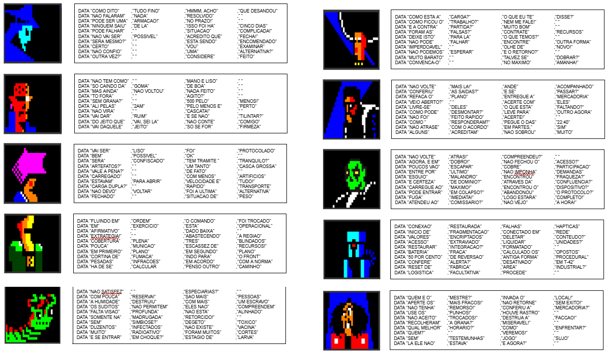
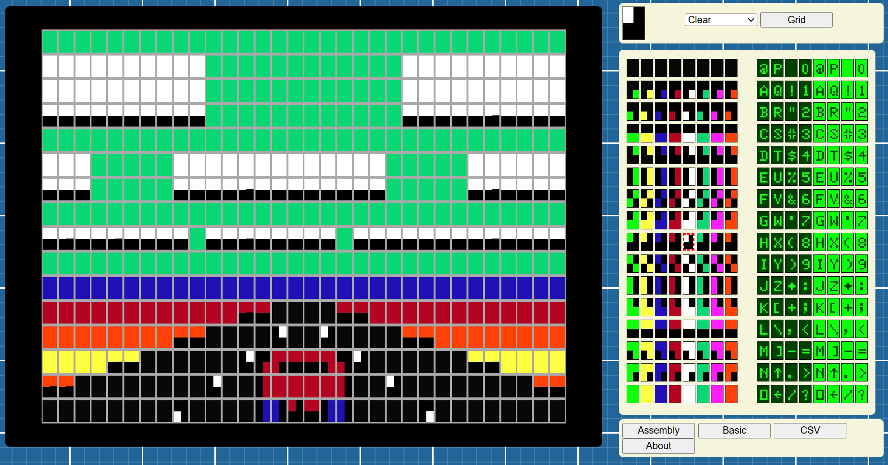
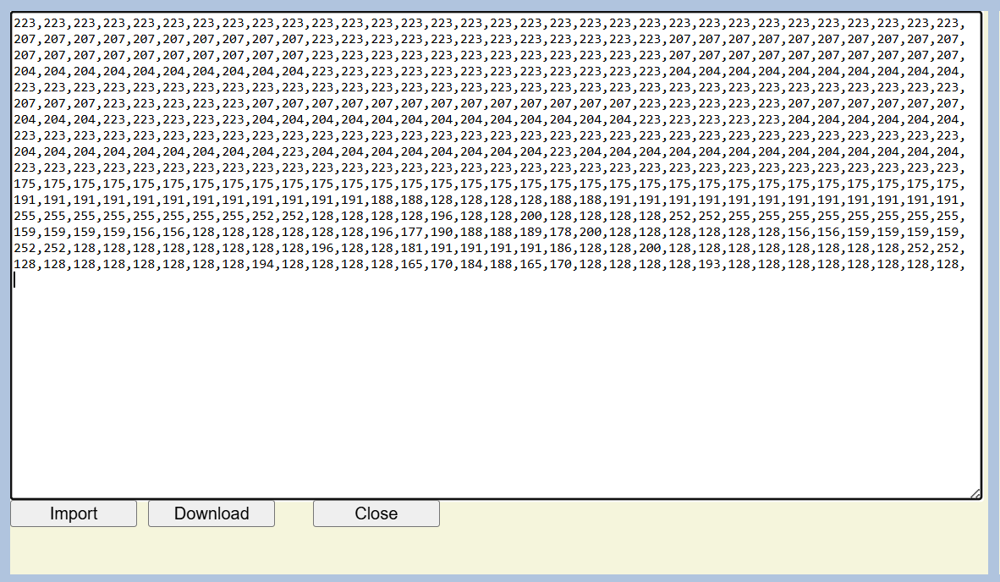
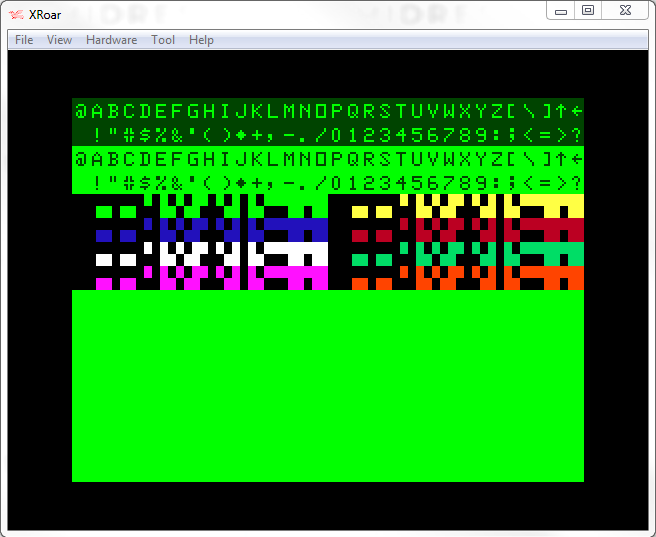
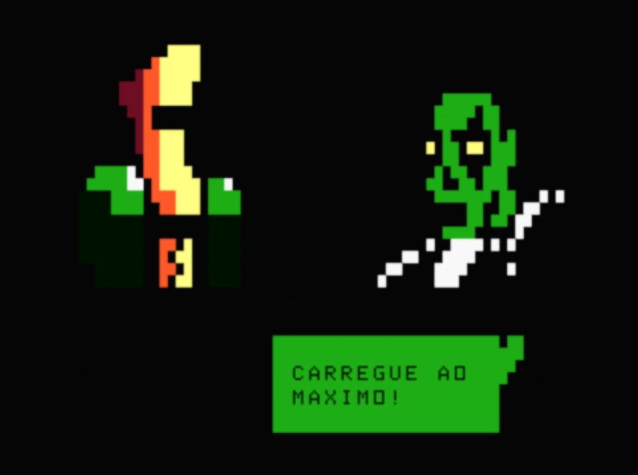
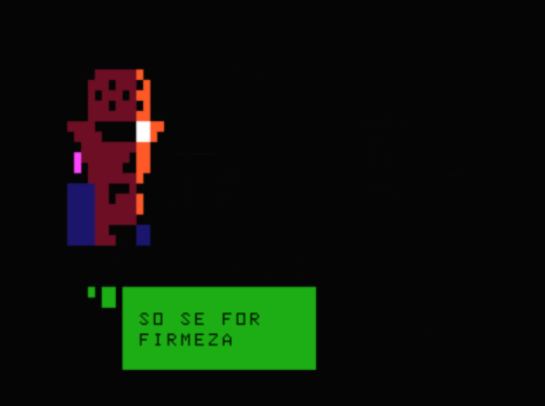

# Make Your Own Story

> *"Open Pilantra is made so people can play around with it, you are free to
> change graphics, dialogs or add anything you please."*
> — FUED.NET, the OPEN PILANTRA manual

The manual ends with an invitation and a question:

> *Does the author's story matter more, or the one we create for ourselves?*

This document is the missing half of that invitation — **how** to actually do
it. Everything below is verified against `original/OPIL-source.bas` and the shipped
disk images.

If you want to know *why* the demo works the way it does, read
[the analysis of the original](../original/README.md). This is the practical
guide.

---

## The idea in one paragraph

OPEN PILANTRA is not a story. It's a **story machine**: ten characters, two
hundred lines of dialogue, four backgrounds and two props, stitched together at
random for about two minutes at a time. The audience does the authoring — they
watch unrelated fragments and assemble a plot in their own heads. Your job as
the author is not to write a narrative. It's to write **fragments that refuse to
contradict each other**, so that any one can follow any other and still feel
intentional.

That constraint is the whole craft, and it's what this guide is mostly about.

---

## The three things you can change

| | Effort | What it changes |
| --- | --- | --- |
| **Dialogue** | Easy — text only | Everything the audience reads |
| **Characters** | Medium — art + a few addresses | Who's on screen |
| **Scenery & props** | Medium — art only | Where it happens |

Start with dialogue. You can rewrite the entire script without touching a single
byte of graphics, and it's the change that most alters the experience.

---

# 1. Rewriting the dialogue

## The cast

Ten characters, in two fixed groups of five. **Left characters and right
characters are not interchangeable** — the code picks one from each side.

| Side | Slot | Label | Array | Character |
| --- | --- | --- | --- | --- |
| Left | `ch1=0` | `manot:` | `mano()` | Mano Courier |
| Left | `ch1=1` | `johnt:` | `john()` | John Trecks |
| Left | `ch1=2` | `elect:` | `elec()` | Elektra |
| Left | `ch1=3` | `captt:` | `capt()` | Captain Glord |
| Left | `ch1=4` | `minht:` | `minh()` | Minhocossul |
| Right | `ch2=0` | `chavt:` | `chav()` | Madame Chavascka |
| Right | `ch2=1` | `kurot:` | `kuro()` | Kurote |
| Right | `ch2=2` | `wolft:` | `wolf()` | Wolf |
| Right | `ch2=3` | `isact:` | `isac()` | Isac |
| Right | `ch2=4` | `shont:` | `shon()` | Shonuf |



*The full roster from the original manual — each portrait beside its `DATA`
block. Left column are the left-side characters, right column the right-side
ones.*

## The shape of a character's script

Each character owns a `DATA` block sitting directly under its label:

```basic
manot:
DATA "AS I SAID"   ,"ALL FINE"     ,"HM, I THINK"  ,"IT WENT SOUTH"
DATA "THEY DIDN'T" ,"SAY ANYTHING" ,"SOLVED"       ," "
DATA "IT CAN BE A" ,"TRAP!"        ,"ON TIME!"     ," "
...
```

Read that as **two balloons per line**:

```
DATA "line 1 of balloon A", "line 2 of balloon A", "line 1 of balloon B", "line 2 of balloon B"
```

So the first `DATA` row above gives you:

> **AS I SAID** / **ALL FINE**  …and…  **HM, I THINK** / **IT WENT SOUTH**

## The hard rules

These are not style advice. Break them and the demo misbehaves.

| Rule | Value | Why |
| --- | --- | --- |
| `DATA` lines per character | **exactly 10** | — |
| Strings per `DATA` line | **exactly 4** | — |
| Total strings per character | **exactly 40** (= 20 balloons) | The picker reads up to 20 pairs forward |
| Max characters per string | **13** | Wider than the balloon; it will overrun |
| Lines per balloon | **2** | The balloon is only two rows tall |

**Why exactly 20 balloons.** The line picker rolls `x=RND(20)*2` and then reads
that many pairs forward from the character's label:

```basic
x=RND(20)*2
DO
    READ SAFE t1
    READ SAFE t2
    EXIT IF x=0
    x=x-2
LOOP
```

It can walk up to 20 pairs. Give a character fewer and the tail rolls fall off
the end of the block — `READ SAFE` won't crash, but you'll get blank balloons.
Give it more and the extras are simply unreachable.

**For a one-line balloon, use `" "` — a space, not an empty string.** That's the
convention throughout the original:

```basic
DATA "OK"          ," "            ,"WILL CHECK"   ,"THAT"
```

**13 characters is a hard ceiling.** The balloon spans 14 columns and the text
starts one column in. Verified against the original: the longest strings in the
shipped script are exactly 13 (`"IT WENT SOUTH"`, `"FIVE DAYS AGO"`).

## The craft rules

From the manual:

> *"The text must be subjective and proper to mix with the others, there is a
> slight tendency for the right NPC to ask questions and the left one to answer
> them."*

That's the entire secret, and it's worth unpacking, because it's what makes a
random shuffle read as a conversation.

**Write replies that fit any question.** Every line you write will eventually
follow every other line, including lines from characters you never imagined it
next to. So avoid anything that pins down a specific referent:

| Avoid | Prefer | Why |
| --- | --- | --- |
| `"THE RED BOX"` | `"THE PACKAGE"` | A named object contradicts the next scene |
| `"YES"` | `"CONSIDER IT"` | Bare agreement needs a real question before it |
| `"AT 4 PM FRIDAY"` | `"ON TIME!"` | Specifics collide |
| `"TELL MARIA"` | `"TELL THEM"` | Names outside the cast break the world |

**Stay in one register.** The original is uniformly clipped, transactional,
faintly criminal — cargo, protocols, deadlines, people who didn't make it. That
consistency is doing enormous work. Any register will do (medical, courtroom,
spacefaring) as long as *all two hundred lines share it*.

**Lean the right side toward questions.** `"IS IT?"`, `"ARE EXITS CHECKED?"`,
`"WHAT IF NO FUN?"` — and the left side toward answers: `"SOLVED"`,
`"CONSIDER IT DONE"`, `"NOT POSSIBLE"`. It's only a tendency, not enforced by
the code, but it's why the exchanges feel like exchanges. Note that the code
alternates who speaks first (`w=RND(2)`), so both orders occur.

**Ambiguity is the point.** A line that could be a threat *or* a reassurance
will land differently depending on who it follows. Those are your best lines.

## Where to edit

**Easiest: edit `story/dialogue.json`.** That file is the source of truth for
text — the build emits the `DATA` blocks from it, so your words go straight to
the screen:

```json
{
  "label": "manot",
  "name": "Mano Courier",
  "side": "left",
  "slot": 0,
  "balloons": [
    ["AS I SAID", "ALL FINE"],
    ["HM, I THINK", "IT WENT SOUTH"]
  ]
}
```

Then:

```sh
make dialogue-lint    # catches over-long lines and miscounts before you build
make run
```

That's the whole loop — roughly a minute to rebuild and boot.

The `DATA` blocks are still present in `original/OPIL-source.bas`, but the build
ignores them — editing them there has no effect. Change the JSON.

---

# 2. Changing the characters

## How a portrait is stored

Each character is a byte array of SG4 tile IDs:

```basic
DIM mano(176) AS BYTE =#{128,128,128,128,128,167,175,175,128,...
```

| Property | Value |
| --- | --- |
| Array size | 176 bytes |
| **Row stride** | **16 bytes** |
| Columns actually drawn | **15** (`x=0..14`) |
| Rows actually drawn | **10** (`y=0..9`) |

**The stride is 16 but only 15 columns render.** Lay your art out 16 wide and
the 16th column of every row will be invisible — it's padding. This trips people
up; budget for it when exporting.

The draw routines are dead simple:

```basic
drawchrl:                                     :REM left, screen col 0
IF ch1=0 THEN POKE 1024+x+y*32, mano(x+y*16)
...
drawchrr:                                     :REM right, screen col 16
IF ch2=0 THEN POKE 1040+x+y*32, chav(x+y*16)
```

The only difference between left and right is `+16`.

## Drawing the art

The manual recommends **SGEditor** by Simon Jonassen:
<https://daftspaniel.neocities.org/tools/sgeditremix/>



*SGEditor — pick a tile on the right, paint on the left. Works online or
offline.*



*Export as CSV and you have the byte list ready to paste into a `DIM`.*

The original workflow was: **draw in Photoshop first, then redraw in SGEditor**
— design the silhouette where you have real tools, then translate it to tiles.

For reference, every SG4 tile ID at once:



*IDs 0–255. The top rows are text; 128–255 are the graphics tiles you want.*

## The SG4 byte, if you'd rather compute it

```
tile = 128 + (color × 16) + quadrant_bits
```

`quadrant_bits` is 0–15, one bit per 2×2 cell quadrant:

```
 bit 3 │ bit 2      8 │ 4
───────┼───────   ────┼────
 bit 1 │ bit 0      2 │ 1
```

| Color | Index | Solid tile (all 4 quadrants) |
| --- | --- | --- |
| Green | 0 | `143` |
| Yellow | 1 | `159` |
| Blue | 2 | `175` |
| Red | 3 | `191` |
| Buff / white | 4 | `207` |
| Cyan | 5 | `223` |
| Magenta | 6 | `239` |
| Orange | 7 | `255` |

`128` is an empty (black) cell — that's your transparent background.

**One color per cell.** This is the defining constraint of SG4: a single 2×2
cell cannot mix colors. Bold shapes with one accent color per figure read far
better than fussy detail. The original art leans into this rather than fighting
it.

## The part everyone forgets: mouth addresses

Portraits are drawn **once**. The talking animation then flips a handful of
**hardcoded screen addresses** — so if you redraw a character, you must find its
mouth again by hand.

```basic
IF ch1=2 THEN:                       :REM ELEKTRA
    DO
        POKE 1255,188:WAIT #150 MILLISECONDS
        POKE 1255,191:WAIT #150 MILLISECONDS
        INC x:EXIT IF x=6
    LOOP
ENDIF
```

Elektra's whole mouth is **one byte**. Captain Glord uses twelve and reads as a
head turning. Both are valid; more bytes means more motion.

**Converting an address to a grid position:**

```
row = (address - 1024) \ 32
col = (address - 1024) MOD 32
```

Elektra's `1255` → `231 \ 32 = 7`, `231 MOD 32 = 7` → **row 7, column 7**.

**And back again:**

```
address = 1024 + (row × 32) + col
```

Left portraits occupy columns 0–14, right portraits columns 16–30, both rows
0–9. Pick the cells that should move, compute their addresses, and write two
alternating sets of `POKE`s. Keep the `WAIT #150` and the `EXIT IF x=6` — six
cycles at 150 ms is about 1.8 seconds, which matches the reading time of a
balloon.

## Adding an eleventh character

The count is baked into several places. To add a sixth left-hand character you
must change **all** of these:

1. `ch1=RND(5)` → `ch1=RND(6)` in the `dialog:` setup
2. A new `DATA` block with a new label, exactly 40 strings
3. A new `DIM` array, 176 bytes
4. `drawchrl:` — add `IF ch1=5 THEN POKE 1024+x+y*32, newguy(x+y*16)`
5. The `RESTORE` chain — add `IF ch1=5 THEN RESTORE newt`
6. The talking animation — add an `IF ch1=5 THEN:` block with mouth `POKE`s

Miss any one and you get a character who is invisible, mute, or speaks in
someone else's voice. Replacing an existing character is much less error-prone:
swap the array contents, the `DATA` strings and the mouth addresses, and nothing
else moves.

---

# 3. Scenery and props

## Backgrounds

Four exist: `midl()` (mid alley), `dock()`, `citi()` (city), `spac()` (space
port). Each is:

```basic
DIM midl(896) AS BYTE =#{...}
```

| Property | Value |
| --- | --- |
| Size | 896 bytes |
| Width | **64 tiles** |
| Height | **14 tiles** |
| Indexing | `midl(x + z + y*64)` |

The screen is 32 columns, so a background is **twice as wide as the display**.
`z` is the horizontal window offset — that's what makes panning possible. Draw
with the full 64 columns in mind: the demo shows either a static window into it
or scrolls across the whole thing.

To swap a background, replace the 896 bytes. To add a fifth you'd extend the
`sc=RND(4)` chooser and add matching `IF sc=4 THEN POKE ...` lines in each of
the three draw loops (still, scroll-left, scroll-right).

## Props

Two exist, chosen by `z=RND(2)` in `object:` — a briefcase and a safe. They use
their own dimensions (`suitA` is 32 wide, `safe` is 19 wide), so if you add one,
match the loop bounds to your art.

There's a conspicuous run of blank lines before the `RETURN` in `object:` where
the author clearly intended more.

## Two effects worth stealing

**Full-screen color flash.** `EMPTYTILE` sets the character `CLS` fills with, so
a camera-flash cut costs four statements:

```basic
EMPTYTILE=175:CLS:WAIT 75 MILLISECONDS     :REM blue
EMPTYTILE=223:CLS:WAIT 75 MILLISECONDS     :REM cyan
EMPTYTILE=207:CLS:WAIT 400 MILLISECONDS    :REM white
EMPTYTILE=128:CLS                          :REM back to black
```

**Lighting from one sprite.** The safe's "lights down / lights up" isn't two
sets of art — it's index arithmetic choosing whether each screen row reads the
lit row or the dark row of the same array. Varying the `WAIT` between passes
(30 ms, 60 ms, 80 ms) gives the sweep an ease that a constant delay wouldn't.

---

# 4. Balloons, and the speech/thought distinction

Two balloon types, and the difference is only three `POKE`s.



*Two characters present — a solid stepped tail. Someone is speaking.*



*One character alone — separate dots trailing up. They're thinking.*

The solo scene happens when `z=7` is rolled, which draws only one character and
runs no mouth animation. It's a mood beat, and it's worth writing a few lines
that work as interior monologue rather than dialogue.

> **Note on the source comments:** in the scene loop the branch labelled
> `:REM DIALOG` is the one that actually renders the *thought* dots, and vice
> versa. The comments are swapped; the rendering is correct. Don't "fix" the
> `POKE`s to match the comments — verified against the manual's own screenshots.

## Balloon geometry

| | Left balloon (`w=0`) | Right balloon (`w=1`) |
| --- | --- | --- |
| Columns | 5–18 | 13–26 |
| Rows | 12–15 | 12–15 |
| Text line 1 | `LOCATE 6,13` | `LOCATE 14,13` |
| Text line 2 | `LOCATE 6,14` | `LOCATE 14,14` |
| Fill tile | `143` (solid green) | `143` (solid green) |

---

# 5. Build, test, repeat

```sh
make toolchain    # once, ~30 min — builds ugbc.coco, asm6809, decb
make run          # compile and boot in XRoar
```

Full details in the [README](../README.md#building).

**Tips for iterating:**

- The intro is about 25 seconds before the main loop starts. While tuning
  dialogue, you may want to temporarily `GOTO` past it.
- `make run` bounds the run with `-timeout 120`. Raise it if you want to watch
  longer: `make run TIMEOUT=600`.
- Scenes are random. Seeing a specific character pair may take several runs —
  temporarily pinning `ch1=` and `ch2=` to constants is the fastest way to check
  one character's art and mouth animation.

## Checklist before you call it done

- [ ] Every character has exactly 10 `DATA` lines of 4 strings
- [ ] No string exceeds 13 characters
- [ ] Single-line balloons use `" "`, not `""`
- [ ] Every redrawn character has its mouth addresses updated
- [ ] Portrait arrays are laid out 16 wide, 15 visible
- [ ] Read your lines in a random order out loud — do any two contradict?

---

## Credits

Original demo, artwork and manual by **Erico Patricio Monteiro**, released as
**FUED.NET**, 2026 — <https://fued.net/open-pilantra/>. Every figure in this
document is clipped from his manual.

Built with [ugBASIC](https://ugbasic.iwashere.eu/) by Marco Spedaletti.
SGEditor by Simon Jonassen.

If you build something on top of this, the author asks only that you consider
donating to support future projects. And if you make a story worth seeing,
he'd probably like to know.

*Have fun.*
